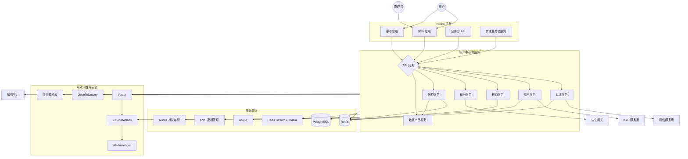
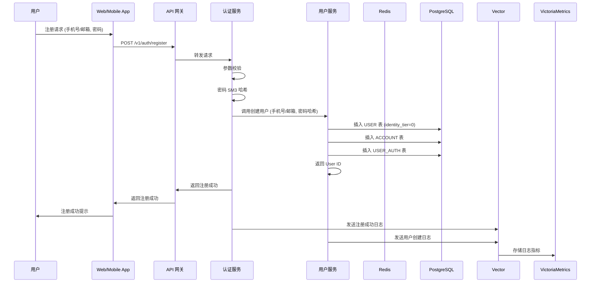
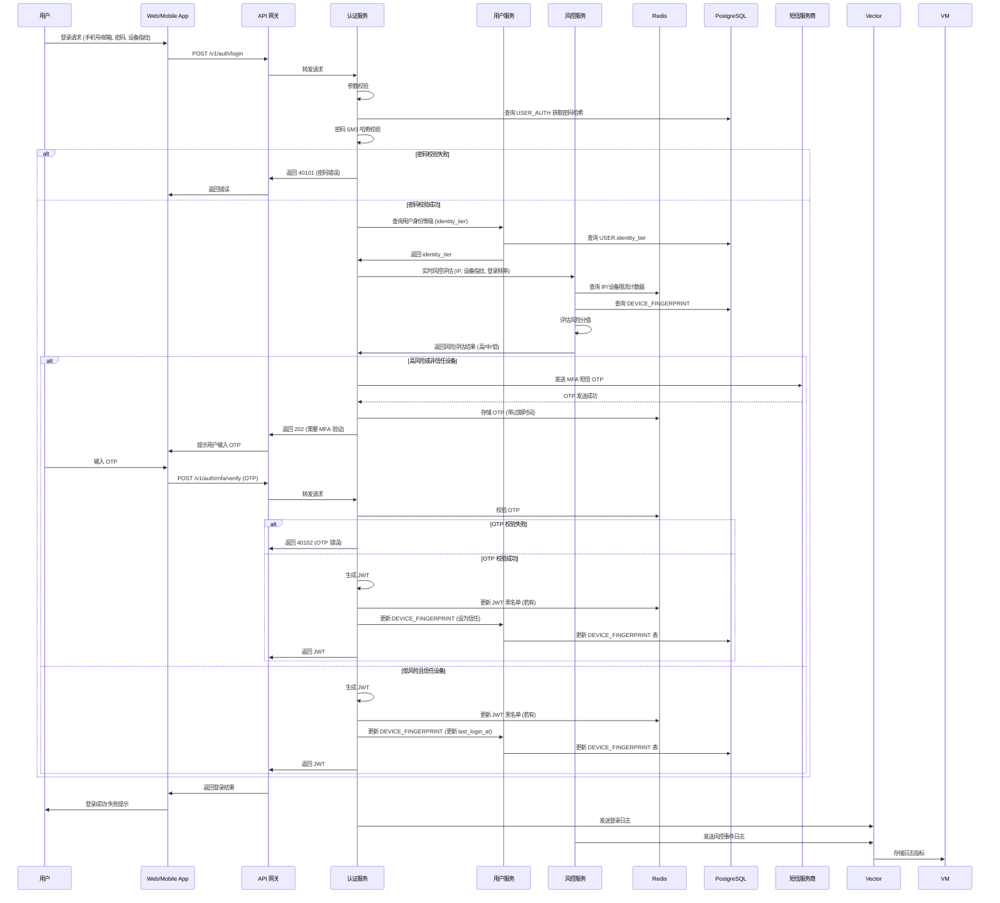
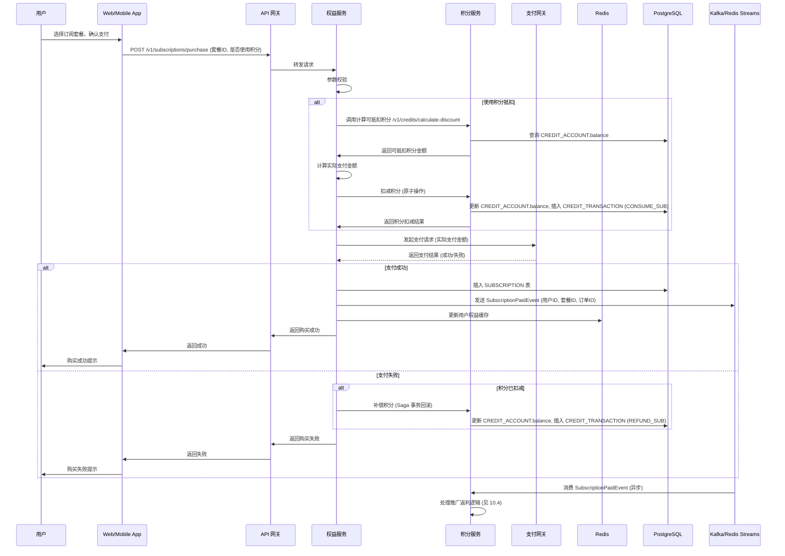
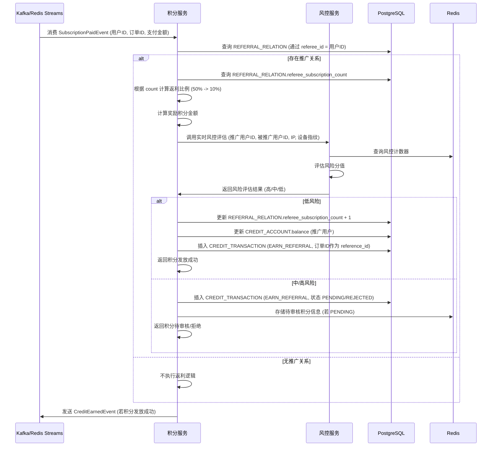

# **账户管理微服务 (Account Center) 技术实现方案 V1.3.0 (全量版)**

**版本：** V1.3.0 (全量商业化迭代版)
**状态：** 开发就绪 (Production Ready)
**核心目标：** 基于极致降本与合规可靠原则，采用 Go/Gin 为主的技术栈，构建支持五级身份中控、奖励积分账务、阶梯退坡返利及全链路防刷风控的账户管理微服务，并提供数据产品与安全合规保障。

## **1. 架构设计与技术选型**

### **1.1 总体架构图 (System Architecture)**

### **1.2 技术选型与环境策略**

技术选型需兼顾开发测试环境的**极致降本**与生产环境的**合规可靠**，同时保证**代码与协议的一致性**以实现平稳过渡。

#### **1.2.1 核心语言与展现层**
1.  **后端主语言**：强制采用 **Go/Gin**。利用其极低内存占用与高并发特性，单台低配裸机即可承载数十个微服务实例。所有账户中心微服务（认证、用户、权益、积分、风控、数据产品服务）均基于 Go/Gin 开发。
2.  **前端框架**：统一采用 **Vue 3 结合 UniApp**。实现一套代码多端发布，极限降低适配工作量，覆盖 Web、H5、小程序、App 等。
3.  **备选审批项（Java）**：在开发**企业级复杂系统**或**事务密集型服务**时，允许将 **Java（JDK 17/21 LTS）**作为备选架构。但必须提前提交 ADR (Architecture Decision Record) 文档说明选型理由，经**架构委员会审批通过**后方可使用。账户中心微服务中，若积分账务或风控核心逻辑涉及极高事务一致性或复杂规则引擎，可考虑申请 Java 备选。

#### **1.2.2 流量与基础设施层**
1.  **Dev/Test（本地宿主机）**：开发者本地 Docker 环境。每个项目独立 Docker Compose 项目（使用 `-p <项目编号>` 参数），容器、网络、数据卷完全隔离，无共享基础设施。强调本地环境的快速启动、隔离性与低成本。
2.  **UAT（阿里云ECS）**：采用共享 Tier1 基础设施模式。单节点 Nginx (作为 API Gateway)、PostgreSQL 18、Redis 7、MinIO、VictoriaMetrics。这些共享服务通过 `platformctl` 工具统一管理，确保环境一致性与资源利用率。UAT 环境主要用于集成测试、业务验收和性能基线测试。
3.  **Production（阿里云 K8s/ECS）**：
    *   **API Gateway**：生产环境采用云厂商提供的 API Gateway 服务或自建高可用 Nginx/Kong 集群。
    *   **微服务部署**：核心微服务部署在阿里云容器服务 ACK (Kubernetes) 或 ECS 实例上，实现高可用和弹性伸缩。

#### **1.2.3 数据与存储层**
1.  **Dev/Test（本地宿主机）**：
    *   **数据库**：可连接 UAT 共享基础设施（PostgreSQL 18、Redis 7、MinIO），或本地运行轻量副本（如 Docker 中的 PostgreSQL/Redis/MinIO）。每个项目独立，资源不共享，确保开发隔离性。
    *   **文件存储**：本地 MinIO 实例或连接 UAT MinIO。
2.  **UAT（阿里云ECS）**：共享**单机自建 PostgreSQL 18**、**单机自建 Redis 7**、**单机自建 MinIO**。所有资源通过资源登记表（附录A-F）统一管理，防止冲突，确保 UAT 环境的稳定性和可控性。
3.  **Production（阿里云 RDS/Redis/OSS）**：
    *   **数据库**：采用阿里云 RDS PostgreSQL (高可用版)，提供主从复制、自动备份、故障切换等能力。
    *   **缓存**：采用阿里云 Redis (高可用版)，支持集群模式，提供高性能缓存服务。
    *   **对象存储**：采用阿里云 OSS，用于存储用户头像、KYB 证件等非结构化数据。

#### **1.2.4 核心中间件层**
1.  **开发测试环境**：
    *   **消息队列**：使用 **Redis Streams** 处理轻量消息，满足微服务间异步通信需求，实现极致降本。
    *   **任务调度**：使用 **Asynq** 进行任务调度，轻量、高效，与 Go 语言栈高度契合。
2.  **生产环境**：
    *   **消息队列**：涉及财务对账、核心订单等必须保证消息零丢失的场景，必须上**云托管 Kafka 或 RocketMQ** (如阿里云消息队列 Kafka/RocketMQ)。非核心业务可继续使用 Redis Streams。
    *   **任务调度**：全环境保持一致使用 **Asynq**，确保任务调度逻辑在各环境的统一性。

#### **1.2.5 安全与风控层**
安全与风控层在**全环境必须保持一致**，必须在开发测试阶段就严格跑通，确保生产环境的合规可靠性：
1.  **认证与阻断**：采用 **JWT (JSON Web Token) 结合 Redis 黑名单**机制。JWT 用于无状态认证，Redis 黑名单用于实现实时 Token 失效和强制注销，满足等保三级会话控制要求。
2.  **设备风控**：使用 **FingerprintJS 结合自研引擎**替代收费商业版。通过采集设备指纹信息，结合 IP、行为模式等数据，构建轻量级但有效的风控模型，识别异常登录和推广作弊行为。
3.  **加密算法**：强制采用**国密算法（SM2/SM3/SM4）**满足金融合规底线。SM4 用于敏感数据存储加密，SM3 用于数据完整性校验和密码哈希，SM2 用于数字签名和密钥交换（若有）。
4.  **密钥管理**：敏感配置（如 AK/SK、数据库密码、第三方服务密钥）**禁止明文写入代码或配置文件**。必须通过密钥管理服务（如 HashiCorp Vault 或云厂商 KMS）注入，且审计所有访问记录，确保密钥的生命周期安全。

#### **1.2.6 第三方服务与触达层**
第三方服务与触达层同样在**全环境保持一致**，确保业务逻辑和用户体验的统一性：
1.  **消息触达**：常规通知走**微信体系**（公众号/小程序/模板消息）及 **App 内推**免费通道，仅合规强制环节（如实名认证通知、密码重置验证码）使用短信，以降低成本。
2.  **实名认证**：采用**银企直连与人脸核身**（通过 KYB 服务商集成）。并强制执行**延迟认证策略**，即新用户注册后，部分功能需实名认证，但认证结果的最终确认可能存在一定延迟，以杜绝羊毛党刷爆接口费，降低风控成本。

#### **1.2.7 监控与运维层**
1.  **开发测试环境**：采用**单机 VictoriaMetrics** (轻量级时序数据库)、**Vector** (高性能日志/指标收集器) 以及 **OpenTelemetry（纯埋点打入日志）**。 **降本策略**：放弃笨重的 ELK 和 Jaeger 服务端，采用 VictoriaMetrics 配合纯埋点 TraceID 关联日志的轻量方案，足以满足生产环境绝大部分的故障排查需求，同时**省下海量服务器成本**。
2.  **生产环境**：
    *   **指标监控**：VictoriaMetrics 集群，配合 Grafana 进行可视化。
    *   **日志管理**：Vector 收集日志，存储至对象存储 (OSS) 或 VictoriaMetrics (日志指标化)，通过 Grafana Loki (可选，若日志量巨大) 进行查询。
    *   **链路追踪**：OpenTelemetry SDK 埋点，TraceID 注入日志，通过日志分析工具进行关联查询。
    *   **告警**：Alertmanager 接收 VictoriaMetrics 告警，并发送至钉钉、企业微信等。

## **2. 数据库模型设计 (Database Schema - ERD)**

为支持账户中心所有功能（基础账户、安全、商业化），数据库模型如下。所有表均采用 PostgreSQL 存储。

### **2.1 实体关系说明**

为支持账户中心所有功能（基础账户、安全、商业化），数据库模型如下。所有表均采用 PostgreSQL 存储。

#### **USER (用户表)**
| 字段名             | 类型      | 描述                                 | 备注         |
| :----------------- | :-------- | :----------------------------------- | :----------- |
| `id`               | `bigint`  | 用户唯一标识                         | 主键         |
| `account_id`       | `varchar` | 用户账户 ID                          | 唯一索引     |
| `phone`            | `varchar` | 手机号                               | 唯一索引     |
| `email`            | `varchar` | 邮箱                                 | 唯一索引     |
| `identity_tier`    | `int`     | 身份等级 (0=L0, 1=L1, 2=L2, 3=L3, 4=L4) |              |
| `real_name`        | `varchar` | 真实姓名                             |              |
| `id_card_number`   | `varchar` | 身份证号                             |              |
| `created_at`       | `timestamp` | 创建时间                             |              |
| `updated_at`       | `timestamp` | 更新时间                             |              |
| `last_login_at`    | `timestamp` | 最后登录时间                         |              |
| `last_login_ip`    | `varchar` | 最后登录 IP                          |              |
| `status`           | `varchar` | 用户状态 (ACTIVE, INACTIVE, FROZEN)  |              |

#### **ACCOUNT (账户凭证表)**
| 字段名       | 类型      | 描述                                 | 备注         |
| :----------- | :-------- | :----------------------------------- | :----------- |
| `id`         | `bigint`  | 账户凭证唯一标识                     | 主键         |
| `user_id`    | `bigint`  | 用户 ID                              | 外键 (USER.id) |
| `type`       | `varchar` | 凭证类型 (PHONE, EMAIL, ACCOUNT_ID)  |              |
| `identifier` | `varchar` | 凭证标识 (手机号、邮箱、自定义账户名) | 唯一索引     |
| `credential` | `varchar` | 凭证密文 (密码哈希、OTP)             |              |
| `status`     | `varchar` | 凭证状态 (ACTIVE, INACTIVE)          |              |
| `created_at` | `timestamp` | 创建时间                             |              |
| `updated_at` | `timestamp` | 更新时间                             |              |

#### **USER_AUTH (用户认证信息表)**
| 字段名         | 类型      | 描述                                 | 备注         |
| :------------- | :-------- | :----------------------------------- | :----------- |
| `id`           | `bigint`  | 认证信息唯一标识                     | 主键         |
| `user_id`      | `bigint`  | 用户 ID                              | 外键 (USER.id) |
| `auth_type`    | `varchar` | 认证方式 (PASSWORD, SMS_OTP, EMAIL_OTP) |              |
| `auth_key`     | `varchar` | 认证凭证键 (如手机号、邮箱)          |              |
| `auth_secret`  | `varchar` | 认证凭证密文 (如密码哈希、OTP 密钥)  |              |
| `created_at`   | `timestamp` | 创建时间                             |              |
| `updated_at`   | `timestamp` | 更新时间                             |              |
| `last_used_at` | `timestamp` | 最后使用时间                         |              |

#### **DEVICE_FINGERPRINT (设备指纹表)**
| 字段名           | 类型      | 描述                                 | 备注         |
| :--------------- | :-------- | :----------------------------------- | :----------- |
| `id`             | `bigint`  | 设备指纹唯一标识                     | 主键         |
| `user_id`        | `bigint`  | 用户 ID                              | 外键 (USER.id) |
| `device_id`      | `varchar` | 设备 ID                              |              |
| `fingerprint_hash` | `varchar` | 设备指纹哈希值                       | 唯一索引     |
| `device_info`    | `varchar` | 设备信息 (User-Agent, 屏幕分辨率等)  |              |
| `ip_address`     | `varchar` | IP 地址                              |              |
| `last_login_at`  | `timestamp` | 最后登录时间                         |              |
| `trusted_until`  | `timestamp` | 信任过期时间                         |              |
| `is_trusted`     | `boolean` | 是否为信任设备                       |              |

#### **AUDIT_LOG (审计日志表)**
| 字段名       | 类型      | 描述                                 | 备注         |
| :----------- | :-------- | :----------------------------------- | :----------- |\n| `id`         | `bigint`  | 日志唯一标识                         | 主键         |
| `user_id`    | `bigint`  | 用户 ID                              | 外键 (USER.id) |
| `event_type` | `varchar` | 事件类型 (LOGIN, LOGOUT, CHANGE_PWD) |              |
| `event_source` | `varchar` | 事件来源 (Web, Mobile, API)          |              |
| `ip_address` | `varchar` | 操作 IP                              |              |
| `details`    | `jsonb`   | 事件详情 (JSON 格式)                 |              |
| `result`     | `varchar` | 操作结果 (SUCCESS, FAILED)           |              |
| `created_at` | `timestamp` | 创建时间                             |              |

#### **KYB_INFO (企业认证信息表)**
| 字段名               | 类型      | 描述                                 | 备注         |
| :------------------- | :-------- | :----------------------------------- | :----------- |
| `id`                 | `bigint`  | KYB 信息唯一标识                     | 主键         |
| `user_id`            | `bigint`  | 用户 ID                              | 外键 (USER.id) |
| `company_name`       | `varchar` | 公司名称                             |              |
| `business_license_no` | `varchar` | 营业执照号                           |              |
| `legal_person_name`  | `varchar` | 法人姓名                             |              |
| `legal_person_id_card` | `varchar` | 法人身份证号                         |              |
| `verification_status` | `varchar` | 认证状态 (PENDING, APPROVED, REJECTED) |              |
| `verification_details` | `jsonb`   | 认证详情 (如拒绝原因)                |              |
| `created_at`         | `timestamp` | 创建时间                             |              |
| `updated_at`         | `timestamp` | 更新时间                             |              |

#### **SUBSCRIPTION (订阅表)**
| 字段名         | 类型      | 描述                                 | 备注         |
| :------------- | :-------- | :----------------------------------- | :----------- |
| `id`           | `bigint`  | 订阅唯一标识                         | 主键         |
| `user_id`      | `bigint`  | 用户 ID                              | 外键 (USER.id) |
| `tier_level`   | `int`     | 订阅等级 (L2, L3, L4)                |              |
| `start_time`   | `timestamp` | 订阅开始时间                         |              |
| `end_time`     | `timestamp` | 订阅结束时间                         |              |
| `status`       | `varchar` | 订阅状态 (ACTIVE, EXPIRED, CANCELED) |              |
| `price`        | `decimal` | 订阅价格                             |              |
| `payment_method` | `varchar` | 支付方式                             |              |
| `order_id`     | `varchar` | 订单 ID                              |              |
| `created_at`   | `timestamp` | 创建时间                             |              |
| `updated_at`   | `timestamp` | 更新时间                             |              |

#### **ENTITLEMENT (权益表)**
| 字段名         | 类型      | 描述                                 | 备注         |
| :------------- | :-------- | :----------------------------------- | :----------- |
| `id`           | `bigint`  | 权益唯一标识                         | 主键         |
| `user_id`      | `bigint`  | 用户 ID                              | 外键 (USER.id) |
| `feature_code` | `varchar` | 权益功能码 (如 `api_call_limit`)     |              |
| `total_quota`  | `int`     | 总配额                               |              |
| `used_quota`   | `int`     | 已使用配额                           |              |
| `reset_time`   | `timestamp` | 配额重置时间                         |              |
| `created_at`   | `timestamp` | 创建时间                             |              |
| `updated_at`   | `timestamp` | 更新时间                             |              |

#### **CREDIT_ACCOUNT (奖励积分账户表)**
| 字段名       | 类型      | 描述                                 | 备注         |
| :----------- | :-------- | :----------------------------------- | :----------- |
| `id`         | `bigint`  | 积分账户唯一标识                     | 主键         |
| `user_id`    | `bigint`  | 用户 ID                              | 外键 (USER.id) |
| `balance`    | `decimal` | 积分余额                             |              |
| `status`     | `varchar` | 账户状态 (ACTIVE, FROZEN)            |              |
| `created_at` | `timestamp` | 创建时间                             |              |
| `updated_at` | `timestamp` | 更新时间                             |              |

#### **CREDIT_TRANSACTION (奖励积分交易流水表)**
| 字段名          | 类型      | 描述                                 | 备注         |
| :-------------- | :-------- | :----------------------------------- | :----------- |
| `id`            | `bigint`  | 交易流水唯一标识                     | 主键         |
| `credit_account_id` | `bigint`  | 积分账户 ID                          | 外键 (CREDIT_ACCOUNT.id) |
| `type`          | `varchar` | 交易类型 (EARN_REFERRAL, CONSUME_SUB) |              |
| `amount`        | `decimal` | 交易金额 (积分数量)                  |              |
| `reference_id`  | `varchar` | 关联业务 ID (如订单 ID, 推广记录 ID) |              |
| `details`       | `jsonb`   | 交易详情 (JSON 格式)                 |              |
| `created_at`    | `timestamp` | 创建时间                             |              |

#### **REFERRAL_RELATION (推广关系表)**
| 字段名                   | 类型      | 描述                                 | 备注         |
| :----------------------- | :-------- | :----------------------------------- | :----------- |
| `id`                     | `bigint`  | 推广关系唯一标识                     | 主键         |
| `referrer_id`            | `bigint`  | 推广人用户 ID                        | 外键 (USER.id) |
| `referee_id`             | `bigint`  | 被推广人用户 ID                      | 外键 (USER.id) |
| `referee_subscription_count` | `int`     | 被推广人订阅次数 (用于计算返利退坡) |              |
| `created_at`             | `timestamp` | 创建时间                             |              |
| `updated_at`             | `timestamp` | 更新时间                             |              |

### **2.1 关键字段说明**
*   `USER.identity_tier`: 用户身份等级 (0=L0, 1=L1, 2=L2, 3=L3, 4=L4)。
*   `ACCOUNT.type`: 账户类型（如 `PHONE`, `EMAIL`, `ACCOUNT_ID`）。
*   `USER_AUTH.auth_type`: 认证类型（如 `PASSWORD`, `SMS_OTP`, `EMAIL_OTP`）。
*   `ENTITLEMENT.feature_code`: 权益标识（如 `api_call_limit`, `storage_space`）。
*   `CREDIT_TRANSACTION.type`: 交易类型（如 `EARN_REFERRAL`, `EARN_VERIFY`, `CONSUME_SUB`）。
*   `REFERRAL_RELATION.referee_subscription_count`: 记录被推广用户的订阅次数，用于计算阶梯退坡比例。

## **3. 核心业务逻辑实现**

### **3.1 统一认证与会话管理**

**设计目标**：提供极简登录体验，支持多因子认证，保障会话安全。

**实现方案**：
1.  **凭证识别**：API Gateway 层或 Auth Service 接收用户输入，通过正则表达式识别手机号、邮箱或账户 ID。Go/Gin 框架的中间件可高效完成此任务。
2.  **认证流程**：
    *   **密码登录**：用户提交密码，Auth Service 使用国密 SM3 对密码进行哈希校验。成功后生成 JWT。
    *   **短信/邮箱 OTP 登录**：Auth Service 调用短信/邮件服务发送 OTP。OTP 存储在 Redis 中，设置过期时间。用户提交 OTP 后进行校验。
    *   **Magic Link 登录**：生成带有时效和唯一 Token 的链接发送至邮箱。用户点击链接后，Auth Service 验证 Token 并自动登录。
3.  **JWT 与会话管理**：
    *   登录成功后，Auth Service 生成 JWT Access Token (短生命周期) 和 Refresh Token (长生命周期)。
    *   JWT 包含 `user_id`, `identity_tier`, `device_id` 等信息，用于后续请求的无状态认证。
    *   **实时阻断**：当用户修改密码、注销账户或管理员强制下线时，将 JWT 的 `jti` (JWT ID) 加入 Redis 黑名单。API Gateway 在每次请求时校验 JWT 是否在黑名单中，实现实时失效。
    *   **会话控制**：Redis 存储用户会话信息，包括 `last_active_time`。Auth Service 定时任务或登录时检查 `last_active_time`，实现静默 20 分钟强制注销。限制单个账户的最大并发会话数。

### **3.2 信任设备与风险感知**

**设计目标**：平衡用户体验与安全，实现智能免验与风险熔断。

**实现方案**：
1.  **设备指纹生成**：前端集成 FingerprintJS 库，生成设备唯一指纹 `fingerprint_hash`。每次登录时，将 `fingerprint_hash` 连同 `device_info` (User-Agent, OS等) 提交给 User Service。
2.  **免验逻辑**：User Service 存储 `DEVICE_FINGERPRINT`。当用户在信任设备登录时，若 `fingerprint_hash` 匹配且 `trusted_until` 未过期，则免除二次验证。
3.  **风险感知熔断**：
    *   **地理位置剧变**：Auth Service 在登录时获取用户 IP，调用 IP 库服务解析地理位置。若当前登录 IP 与历史常用 IP 地理位置差异过大（如跨省市），强制触发强身份核验。
    *   **设备指纹异常**：User Service 对 `fingerprint_hash` 进行相似度比对。若关键特征变化超过阈值，或 `fingerprint_hash` 与历史记录严重不符，强制触发强身份核验。
    *   **风控服务联动**：将上述风险事件发送至 Risk Control Service 进行实时分析和决策。

### **3.3 权益中控与高频核销 (Entitlement Engine)**

**设计目标**：提供低延迟 (<10ms) 的权益校验接口，支持高并发扣减，确保数据一致性。

**实现方案**：
1.  **Redis 预热与缓存**：用户的 `ENTITLEMENT` 数据在登录或订阅状态变更时，由 Entitlement Service 异步加载至 Redis Hash 结构中。
    *   Key: `entitlement:{user_id}`
    *   Field: `{feature_code}`
    *   Value: `{"total": 1000, "used": 50, "reset": 1715644800}` (JSON 存储配额信息)
2.  **Lua 脚本原子扣减**：Entitlement Service 接收其他微服务的权益核销请求，使用 Redis Lua 脚本执行“校验余额 -> 扣减 -> 返回结果”的原子操作，避免并发超卖。
    *   Lua 脚本伪代码：`IF HGET user_quota {feature_code}.total >= HGET user_quota {feature_code}.used + amount THEN HINCRBY user_quota {feature_code}.used amount; RETURN true ELSE RETURN false END`
3.  **异步落库**：扣减成功后，通过 Redis Streams (Dev/Test) 或 Kafka (Prod) 发送 `QuotaConsumedEvent`，由消费端批量异步更新 PostgreSQL 的 `ENTITLEMENT` 表，减轻数据库写压力。
4.  **配额重置**：Asynq 调度任务，每日/每月定时扫描 `ENTITLEMENT` 表，根据 `reset_time` 重置用户配额。

### **3.4 奖励积分账务系统 (Credit Ledger)**

**设计目标**：确保积分发放与抵扣的绝对准确，满足 ACID 特性，防篡改，支持高并发。

**实现方案**：
1.  **复式记账法**：任何积分变动必须生成对应的 `CREDIT_TRANSACTION` 流水。`CREDIT_ACCOUNT` 表仅存储当前余额，所有变动通过 `CREDIT_TRANSACTION` 记录。
2.  **防篡改摘要 (SM3)**：每条 `CREDIT_TRANSACTION` 记录在落库前，将其核心字段（`id`, `credit_account_id`, `type`, `amount`, `reference_id`, `created_at`）以及**前一条流水记录的 SM3 摘要**进行拼接，再使用国密 SM3 算法生成新的摘要并存储。后台定时任务校验 Hash 链，一旦发现篡改立即告警。
3.  **分布式事务 (Saga/TCC)**：在“积分抵扣 + 订阅开通”的跨服务场景中，采用 Saga 模式。若订阅开通失败，必须执行积分退回的补偿操作。Go 语言可利用 `go-saga` 等库实现。
4.  **高并发处理**：积分账户余额更新采用乐观锁或 CAS (Compare And Swap) 机制，避免并发更新问题。

### **3.5 阶梯退坡返利算法 (Tiered Rebate Algorithm)**

**设计目标**：准确计算推广奖励，支持 50%-30%-20%-10% 的退坡逻辑，并防范作弊。

**实现方案**：
1.  **事件驱动**：监听订单系统发出的 `SubscriptionPaidEvent` (通过 Redis Streams 或 Kafka)。
2.  **状态机流转**：
    *   Credit Service 消费 `SubscriptionPaidEvent`，查询 `REFERRAL_RELATION` 获取该被推广用户的历史 `referee_subscription_count` (设为 N)。
    *   根据 N 值匹配奖励比例：
        *   N = 0 (首次订阅)：50%
        *   1 <= N <= 4：30%
        *   5 <= N <= 9：20%
        *   N >= 10：10%
    *   计算奖励积分 = 实付金额 * 比例。
3.  **幂等性处理**：使用订单 ID 作为 `CREDIT_TRANSACTION.reference_id`，利用数据库唯一索引防止重复发放奖励。
4.  **状态更新**：在同一个本地事务中，增加推广用户积分余额、写入流水，并将 `REFERRAL_RELATION.referee_subscription_count` 加 1。
5.  **防作弊联动**：在计算奖励前，调用 Risk Control Service 进行实时风险评估。若判定为高风险，则积分发放状态置为 `PENDING` 或直接拒绝。

### **3.6 全链路防刷风控 (Anti-Fraud Risk Control)**

**设计目标**：识别并拦截恶意注册、虚假实名和薅羊毛行为，降低商业化风险。

**实现方案**：
1.  **实时特征采集**：在注册、实名、登录、推广绑定、积分发放等关键环节，采集 IP、Device Fingerprint (FingerprintJS)、User-Agent、行为轨迹等信息，发送至 Risk Control Service。
2.  **Redis 滑动窗口限流**：
    *   限制单 IP / 单设备指纹在 1 小时内的注册/实名次数（如上限 3 次）。
    *   限制单推广链接在 1 小时内的被使用次数（如上限 50 次，防机器批量刷）。
    *   使用 Redis 的 `INCRBY` 和 `EXPIRE` 命令实现。
3.  **延迟发放机制 (T+N)**：对于大额推广积分（如单笔超过 100 积分），系统自动将其状态置为 `PENDING`。Asynq 调度任务在 T+7 天后（可配置）检查订单状态和用户行为，若无异常，才将积分状态转为 `AVAILABLE`。
4.  **图关系分析 (离线)**：将推广关系数据导入图数据库（如 Neo4j，可选，或通过 Go 语言实现内存图算法），定期运行连通子图算法，识别团伙作弊（如 A 推 B，B 推 C，C 推 A 的闭环）。
5.  **规则引擎**：Risk Control Service 内部可集成轻量级规则引擎 (如 Go 语言的 `goflow` 或 `expr`)，允许运营人员配置动态风控规则。

## **4. 核心 API 接口定义**

### **4.1 认证服务 (Auth Service)**

*   **POST /v1/auth/register**：用户注册 (手机号/账户 ID)
*   **POST /v1/auth/login**：用户登录 (手机号/邮箱/账户 ID + 密码/OTP/Magic Link)
*   **POST /v1/auth/refresh-token**：刷新 Access Token
*   **POST /v1/auth/logout**：用户登出 (JWT 加入黑名单)
*   **POST /v1/auth/password/reset**：重置密码
*   **POST /v1/auth/mfa/enable**：启用 MFA
*   **POST /v1/auth/mfa/verify**：MFA 验证

### **4.2 用户服务 (User Service)**

*   **GET /v1/users/{user_id}**：获取用户基本信息
*   **PUT /v1/users/{user_id}**：更新用户资料
*   **POST /v1/users/{user_id}/kyb/apply**：申请 KYB 认证
*   **GET /v1/users/{user_id}/devices**：获取用户设备列表
*   **DELETE /v1/users/{user_id}/devices/{device_id}**：删除信任设备
*   **POST /v1/users/{user_id}/deactivate**：注销账户
*   **GET /internal/v1/users/{user_id}/tier**：内部查询用户等级

### **4.3 权益服务 (Entitlement Service)**

*   **GET /v1/entitlements/{user_id}**：查询用户所有权益及配额
*   **POST /internal/v1/entitlements/consume**：内部扣减用户配额 (高并发)
*   **POST /internal/v1/entitlements/grant**：内部授予用户权益/配额
*   **POST /v1/subscriptions/purchase**：购买订阅
*   **POST /v1/subscriptions/upgrade**：升级订阅
*   **POST /v1/subscriptions/renew**：续费订阅

### **4.4 积分服务 (Credit Service)**

*   **GET /v1/credits/{user_id}/account**：查询用户积分账户余额
*   **GET /v1/credits/{user_id}/transactions**：查询用户积分交易流水
*   **POST /internal/v1/credits/earn**：内部发放奖励积分
*   **POST /v1/credits/calculate-discount**：计算订阅可抵扣积分
*   **POST /v1/referral/bind**：绑定推广关系
*   **GET /v1/referral/{user_id}/summary**：查询推广收益汇总

### **4.5 风控服务 (Risk Control Service)**

*   **POST /internal/v1/risk/evaluate**：内部实时风险评估 (注册、登录、推广)
*   **POST /internal/v1/risk/event**：上报风险事件
*   **GET /v1/risk/status/{user_id}**：查询用户风险状态

### **4.6 数据产品服务 (Data Product Service)**

*   **GET /internal/v1/data/users/rfm**：内部获取 RFM 用户画像数据 (去标识化)
*   **GET /internal/v1/data/referral/fraud-monitor**：内部获取推广防刷监控数据 (去标识化)

## **5. 安全与合规**

### **5.1 等保三级合规**

*   **身份鉴别**：强制 MFA (管理后台、敏感操作)，密码复杂度要求，防暴力破解 (Redis 计数器)。
*   **访问控制**：基于角色的访问控制 (RBAC)，最小权限原则。API Gateway 进行统一鉴权。
*   **数据加密**：
    *   **传输加密**：所有 API 接口强制使用 HTTPS/TLS 1.2+。
    *   **存储加密**：敏感数据 (实名信息、密码哈希盐、KYB 证件信息) 在 PostgreSQL 落库前，使用国密 SM4 算法进行对称加密。密钥通过 KMS 获取。
    *   **摘要与签名**：密码哈希、关键日志完整性校验、内部服务间通信签名使用国密 SM3 算法。若涉及数字证书，使用国密 SM2 算法。
*   **审计日志**：所有关键操作 (登录、注册、密码修改、KYB 认证、积分变动、权益核销) 均记录审计日志。日志包含主体、时间、行为、结果、IP 等信息。日志通过 Vector 收集，存储至 VictoriaMetrics 或 OSS，留存至少 180 天，并确保不可篡改性 (SM3 校验)。
*   **入侵防范**：部署 WAF (Web Application Firewall) 防御常见 Web 攻击。定期进行安全漏洞扫描和渗透测试。

### **5.2 密钥管理 (KMS)**

*   所有敏感配置 (数据库连接字符串、第三方服务 API Key、国密算法密钥) 均通过 HashiCorp Vault 或云厂商 KMS (如阿里云 KMS) 进行统一管理。
*   微服务启动时，通过 IAM 角色或短期凭证从 KMS 获取所需密钥，禁止硬编码或明文存储。
*   KMS 访问日志进行严格审计，确保密钥使用安全可追溯。

### **5.3 数据脱敏与去标识化**

*   **动态脱敏网关**：在 API Gateway 或 BFF 层实现脱敏拦截器。根据请求者的角色和权限，动态对返回 JSON 中的敏感字段（如手机号 `138****1234`、真实姓名 `张*`）执行掩码操作。
*   **分析去标识化**：数据分析和数据产品服务所使用的数据，必须经过严格的去标识化处理。`user_id` 等唯一标识符在同步至数据仓库前，通过加盐 Hash (如 `SHA256(user_id + salt)`) 转换为不可逆的匿名 ID，确保分析过程不触碰个人隐私。

## **6. 运维监控与告警**

### **6.1 日志管理 (Vector + VictoriaMetrics/OSS)**
*   **日志收集**：所有微服务输出结构化日志 (JSON 格式)，通过 **Vector** 收集。Vector 将日志发送至 VictoriaMetrics (作为日志指标化) 或对象存储 OSS (作为原始日志存储)。
*   **日志查询**：通过 Grafana 连接 VictoriaMetrics (查询日志指标) 或直接查询 OSS (通过 Athena/ClickHouse 等服务)。对于 TraceID，通过在日志中嵌入 `trace_id` 字段，实现日志与链路追踪的关联。

### **6.2 指标监控 (VictoriaMetrics + Grafana)**
*   **指标采集**：微服务通过 Prometheus Client SDK 暴露指标 (HTTP `/metrics` 接口)。VictoriaMetrics Agent (或 Prometheus) 定时抓取这些指标。
*   **核心指标**：包括但不限于：
    *   **系统指标**：CPU、内存、磁盘 I/O、网络流量。
    *   **应用指标**：QPS、P99 延迟、错误率、GC 次数/时间、Goroutine 数量。
    *   **业务指标**：注册成功率、登录成功率、订阅转化率、积分发放/消耗量、权益核销次数、风控拦截次数。
*   **可视化**：Grafana 连接 VictoriaMetrics，构建多维度监控仪表盘。

### **6.3 链路追踪 (OpenTelemetry)**
*   **纯埋点方案**：所有微服务集成 OpenTelemetry SDK，在请求入口和关键业务逻辑点进行埋点，生成 Span 并注入 `trace_id` 和 `span_id` 到日志上下文。
*   **日志关联**：通过在日志中打印 `trace_id`，实现分布式请求的端到端追踪。无需部署 Jaeger/Zipkin 服务端，通过日志聚合查询即可还原链路。

### **6.4 告警管理 (Alertmanager)**
*   **告警规则**：基于 VictoriaMetrics 采集的指标，在 Alertmanager 中配置告警规则 (如 CPU 使用率过高、服务错误率突增、积分余额异常波动、风控拦截率异常)。
*   **告警通知**：Alertmanager 将告警发送至钉钉、企业微信、短信等渠道，确保及时响应。

## **7. 错误码体系**

统一通过 HTTP Status 4xx/5xx + 业务错误码返回，Go/Gin 框架可封装统一的错误处理中间件。

| HTTP Status | 业务错误码 | 描述             | 场景示例                                   |
| :---------- | :--------- | :--------------- | :----------------------------------------- |
| 400         | 40001      | 参数校验失败     | 请求体字段缺失或格式错误                   |
| 401         | 40101      | 未授权           | Token 无效或过期                           |
| 403         | 40301      | 权限不足/配额不足 | 用户等级无法访问某功能，或权益配额已用尽   |
| 403         | 40302      | 风控拦截         | 触发反作弊规则，操作被阻止                 |
| 404         | 40401      | 资源未找到       | 用户 ID 不存在，或订阅记录不存在           |
| 409         | 40901      | 积分余额不足     | 积分抵扣时，用户可用积分不足               |
| 409         | 40902      | 推广关系已存在   | 尝试重复绑定推广关系                       |
| 500         | 50001      | 系统内部错误     | 数据库连接失败，或服务内部异常             |

## **8. 验收标准 (Acceptance Criteria)**

1.  **技术栈对齐**：所有新开发服务必须使用 Go/Gin，前端使用 Vue 3 + UniApp。中间件、存储、安全、监控等严格遵循技术选型策略。
2.  **架构兼容性**：所有新增模块必须无缝集成至现有架构，日志和监控指标必须成功接入 VictoriaMetrics + Vector + OpenTelemetry 体系。
3.  **高并发权益核销**：权益核销接口在 5000 TPS 压力下，P99 延迟必须 < 15ms，且绝对不能出现超卖现象。
4.  **账务一致性**：经过 10 万次并发积分发放与抵扣压测，`CREDIT_ACCOUNT` 余额必须与 `CREDIT_TRANSACTION` 流水总和 100% 一致，且 SM3 摘要校验无异常。
5.  **退坡算法准确性**：针对同一推广链路模拟 15 次连续订阅，系统必须准确按照 50%-30%-20%-10% 的比例发放积分。
6.  **风控有效性**：模拟同一 IP 连续注册 10 个账号，系统必须在第 4 个账号时成功触发拦截并阻断积分发放。模拟异常设备指纹登录，必须触发强身份核验。
7.  **数据脱敏**：非授权角色调用查询接口时，返回的手机号、邮箱等字段必须被正确掩码。数据仓库中的用户敏感数据必须经过去标识化处理。
8.  **密钥管理**：所有敏感配置必须通过 KMS 注入，代码中不得出现明文密钥。
9.  **等保三级**：系统必须通过等保三级测评，所有安全合规要求均需满足。
10. **部署与运维**：Dev/Test 环境 Docker Compose 启动正常，UAT 环境共享基础设施稳定运行，生产环境 K8s 部署自动化，监控告警配置完善。

## **9. 项目里程碑与交付计划 (Roadmap)**

本节从技术角度规划了账户管理微服务商业化迭代的开发与交付节奏。

### **9.1 阶段一：核心账户与商业化基础 (T0 - T + 6周)**
*   **目标**：完成用户注册、登录、基础账户信息管理、五级身份阶梯、订阅管理、基础积分账务的核心模块开发。
*   **技术栈**：Go/Gin, PostgreSQL, Redis, Asynq, OpenTelemetry。
*   **交付物**：
    *   Auth Service (注册、登录、JWT、会话管理)。
    *   User Service (用户资料、设备指纹、身份等级)。
    *   Entitlement Service (身份等级管理、权益配置、基础核销)。
    *   Credit Service (积分账户、积分发放/扣减 API、交易流水)。
    *   `SUBSCRIPTION`, `ENTITLEMENT`, `CREDIT_ACCOUNT`, `CREDIT_TRANSACTION` 数据库表及相关 CRUD API。
    *   Redis 权益缓存机制。
    *   Dev/Test 环境 Docker Compose 部署脚本。

### **9.2 阶段二：安全强化与推广风控 (T + 7周 - T + 12周)**
*   **目标**：增强系统安全性，引入设备指纹和 MFA，完善账户安全功能，实现阶梯退坡推广返利、全链路防刷风控。
*   **技术栈**：Go/Gin, PostgreSQL, Redis, Asynq, 国密算法库。
*   **交付物**：
    *   设备指纹识别与信任机制。
    *   多因子认证 (MFA) 功能 (短信OTP, 邮箱OTP)。
    *   账户锁定、冻结与解冻功能。
    *   JWT 黑名单实时阻断。
    *   国密 SM4/SM3 在敏感数据存储和日志完整性校验中的应用。
    *   `REFERRAL_RELATION` 数据库表及相关 API。
    *   阶梯退坡返利计算引擎 (集成至 Credit Service)。
    *   Risk Control Service (设备指纹、IP 监控、滑动窗口限流、延迟发放)。
    *   推广关系绑定 API。
    *   风控告警集成至 Alertmanager。

### **9.3 阶段三：数据产品与生产环境落地 (T + 13周 - T + 18周)**
*   **目标**：引入 KYB 认证，完善账户注销流程，实现数据产品化，优化部署与运维，达到生产级标准。
*   **技术栈**：Go/Gin, PostgreSQL, Redis, Asynq, Vector, VictoriaMetrics, KMS, 云托管 Kafka/RocketMQ。
*   **交付物**：
    *   KYB Service (KYB 认证流程)。
    *   账户注销流程 (冻结期、永久删除)。
    *   API Gateway 限流、脱敏策略配置。
    *   生产环境云托管 Kafka/RocketMQ 集成。
    *   Vector + VictoriaMetrics + OpenTelemetry 生产环境部署与集成。
    *   动态脱敏网关 (API Gateway 插件或独立服务)。
    *   去标识化数据同步流程 (Debezium + Kafka Streams/Flink)。
    *   Data Product Service (RFM 用户价值画像、推广防刷监控大盘接口)。
    *   自动化部署 CI/CD 流水线。

### **9.4 阶段四：持续优化与新功能 (T + 19周及以后)**
*   **目标**：根据业务发展和用户反馈，持续迭代优化，探索更多增值服务。
*   **交付物**：
    *   更精细化的权益配置与管理。
    *   积分商城或积分兑换更多增值服务。
    *   A/B Test 平台集成，优化推广返利比例。
    *   更高级别的风控策略和模型。
    *   持续的产品优化与迭代计划。

## **10. 核心业务流程序列图 (Sequence Diagrams)**

### **10.1 用户注册流程**

### **10.2 带设备指纹与 MFA 的登录流程**

### **10.3 购买订阅与积分抵扣流程**

### **10.4 推广返利积分发放流程**

## **11. 技术标准与规范**

### **11.1 代码规范**
*   **Go 语言**：遵循 Go 官方编码规范 (`go fmt`, `go vet`)。使用 `golangci-lint` 进行静态代码分析，确保代码质量。
*   **命名规范**：变量、函数、结构体、接口等命名清晰、语义化，遵循 Go 语言惯例。
*   **注释规范**：公共函数、结构体、接口必须编写详细的 Godoc 注释，解释其功能、参数、返回值和使用示例。
*   **错误处理**：统一使用 Go 的 `error` 接口进行错误返回，避免裸露的 `panic`。错误信息应包含足够的上下文，便于排查。

### **11.2 API 接口规范**
*   **RESTful 风格**：遵循 RESTful API 设计原则，使用名词复数作为资源路径，HTTP 方法表示操作。
*   **版本控制**：API 路径中包含版本号 (如 `/v1/`)，便于未来升级。
*   **请求/响应格式**：统一使用 JSON 格式。请求体使用 `application/json`，响应体使用 `application/json`。
*   **错误响应**：统一的错误响应结构，包含 `code` (业务错误码)、`message` (错误描述)、`details` (可选，详细错误信息)。
*   **幂等性**：所有写操作接口 (如创建订单、扣减积分) 必须设计为幂等。客户端在重试时，服务端能保证操作结果的一致性。

### **11.3 数据库规范**
*   **表命名**：小写、下划线分隔 (snake_case)，名词复数 (如 `users`, `credit_transactions`)。
*   **字段命名**：小写、下划线分隔 (snake_case)。
*   **主键**：所有表必须有自增 `bigint` 类型主键 `id`。
*   **外键**：明确定义外键关系，并设置合适的级联操作 (如 `ON DELETE RESTRICT`)。
*   **索引**：根据查询模式合理创建索引，特别是外键、唯一约束和常用查询字段。
*   **时间戳**：所有表必须包含 `created_at` 和 `updated_at` 字段，类型为 `timestamp with time zone`，并设置默认值和自动更新。
*   **软删除**：对于核心业务数据，建议采用软删除策略 (增加 `deleted_at` 字段)，而非物理删除。

### **11.4 消息队列规范**
*   **消息格式**：统一使用 JSON 格式，包含 `event_type`, `timestamp`, `data` (业务数据) 等字段。
*   **消息幂等性**：消费者必须实现消息幂等性处理，防止重复消费导致业务异常。
*   **死信队列 (DLQ)**：所有关键消息队列必须配置死信队列，用于存储处理失败的消息，便于后续排查和重试。

## **12. 验收标准 (Acceptance Criteria)**

在原有验收标准基础上，针对商业化迭代和技术栈调整，增加以下关键验收标准：

1.  **Go/Gin 性能指标**：核心服务 (Auth, Entitlement, Credit) 在 5000 TPS 压力下，CPU 使用率 < 60%，内存占用 < 200MB，P99 延迟 < 15ms。
2.  **奖励积分账务一致性**：
    *   在模拟 10 万次并发推广返利和订阅抵扣场景下，`CREDIT_ACCOUNT` 余额与 `CREDIT_TRANSACTION` 流水总和 100% 一致。
    *   所有 `CREDIT_TRANSACTION` 记录的 SM3 摘要链校验无异常。
3.  **推广返利准确性**：
    *   模拟 1000 条推广链路，每条链路下模拟 15 次被推广用户订阅，系统必须准确按照 50%-30%-20%-10% 的比例发放积分，且无超发、漏发。
    *   模拟高风险推广行为 (如同一 IP 批量注册)，系统必须成功触发风控拦截或延迟发放。
4.  **权益配额原子性**：在 10000 次并发扣减同一用户权益的场景下，权益配额必须实现原子扣减，无超卖。
5.  **数据产品脱敏**：
    *   通过 Data Product Service 接口查询用户画像数据时，所有敏感字段 (如手机号、姓名) 必须正确脱敏或去标识化。
    *   数据仓库中存储的用户敏感数据必须经过去标识化处理，无法直接反向关联到真实用户。
6.  **KMS 集成**：所有服务启动时，必须成功从 KMS 获取敏感配置，且日志中不得出现明文密钥。
7.  **监控告警覆盖**：
    *   VictoriaMetrics 必须成功采集所有微服务的系统、应用和业务指标。
    *   Grafana 仪表盘必须能正确展示关键业务指标 (如积分发放量、订阅转化率、风控拦截率)。
    *   Alertmanager 必须能根据预设规则触发告警，并成功发送通知。
8.  **OpenTelemetry 链路**：通过日志中的 `trace_id`，能够完整追踪跨服务请求的调用链，定位问题。
9.  **Dev/Test 环境**：Docker Compose 启动所有服务必须在 30 秒内完成，且各服务间隔离良好。
10. **生产环境部署**：K8s 部署脚本和配置必须能实现服务的自动化部署、弹性伸缩和滚动升级。

## **13. 项目里程碑与交付计划 (Roadmap)**

本节从技术角度规划了账户管理微服务商业化迭代的开发与交付节奏。

### **13.1 阶段一：核心账户与商业化基础 (T0 - T + 6周)**
*   **目标**：完成用户注册、登录、基础账户信息管理、五级身份阶梯、订阅管理、基础积分账务的核心模块开发。
*   **技术栈**：Go/Gin, PostgreSQL, Redis, Asynq, OpenTelemetry。
*   **交付物**：
    *   Auth Service (注册、登录、JWT、会话管理)。
    *   User Service (用户资料、设备指纹、身份等级)。
    *   Entitlement Service (身份等级管理、权益配置、基础核销)。
    *   Credit Service (积分账户、积分发放/扣减 API、交易流水)。
    *   `SUBSCRIPTION`, `ENTITLEMENT`, `CREDIT_ACCOUNT`, `CREDIT_TRANSACTION` 数据库表及相关 CRUD API。
    *   Redis 权益缓存机制。
    *   Dev/Test 环境 Docker Compose 部署脚本。

### **13.2 阶段二：安全强化与推广风控 (T + 7周 - T + 12周)**
*   **目标**：增强系统安全性，引入设备指纹和 MFA，完善账户安全功能，实现阶梯退坡推广返利、全链路防刷风控。
*   **技术栈**：Go/Gin, PostgreSQL, Redis, Asynq, 国密算法库。
*   **交付物**：
    *   设备指纹识别与信任机制。
    *   多因子认证 (MFA) 功能 (短信OTP, 邮箱OTP)。
    *   账户锁定、冻结与解冻功能。
    *   JWT 黑名单实时阻断。
    *   国密 SM4/SM3 在敏感数据存储和日志完整性校验中的应用。
    *   `REFERRAL_RELATION` 数据库表及相关 API。
    *   阶梯退坡返利计算引擎 (集成至 Credit Service)。
    *   Risk Control Service (设备指纹、IP 监控、滑动窗口限流、延迟发放)。
    *   推广关系绑定 API。
    *   风控告警集成至 Alertmanager。

### **13.3 阶段三：数据产品与生产环境落地 (T + 13周 - T + 18周)**
*   **目标**：引入 KYB 认证，完善账户注销流程，实现数据产品化，优化部署与运维，达到生产级标准。
*   **技术栈**：Go/Gin, PostgreSQL, Redis, Asynq, Vector, VictoriaMetrics, KMS, 云托管 Kafka/RocketMQ。
*   **交付物**：
    *   KYB Service (KYB 认证流程)。
    *   账户注销流程 (冻结期、永久删除)。
    *   API Gateway 限流、脱敏策略配置。
    *   生产环境云托管 Kafka/RocketMQ 集成。
    *   Vector + VictoriaMetrics + OpenTelemetry 生产环境部署与集成。
    *   动态脱敏网关 (API Gateway 插件或独立服务)。
    *   去标识化数据同步流程 (Debezium + Kafka Streams/Flink)。
    *   Data Product Service (RFM 用户价值画像、推广防刷监控大盘接口)。
    *   自动化部署 CI/CD 流水线。

### **13.4 阶段四：持续优化与新功能 (T + 19周及以后)**
*   **目标**：根据业务发展和用户反馈，持续迭代优化，探索更多增值服务。
*   **交付物**：
    *   更精细化的权益配置与管理。
    *   积分商城或积分兑换更多增值服务。
    *   A/B Test 平台集成，优化推广返利比例。
    *   更高级别的风控策略和模型。
    *   持续的产品优化与迭代计划。

