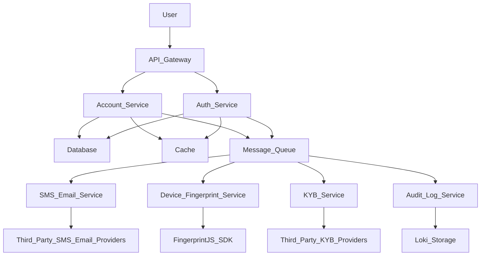
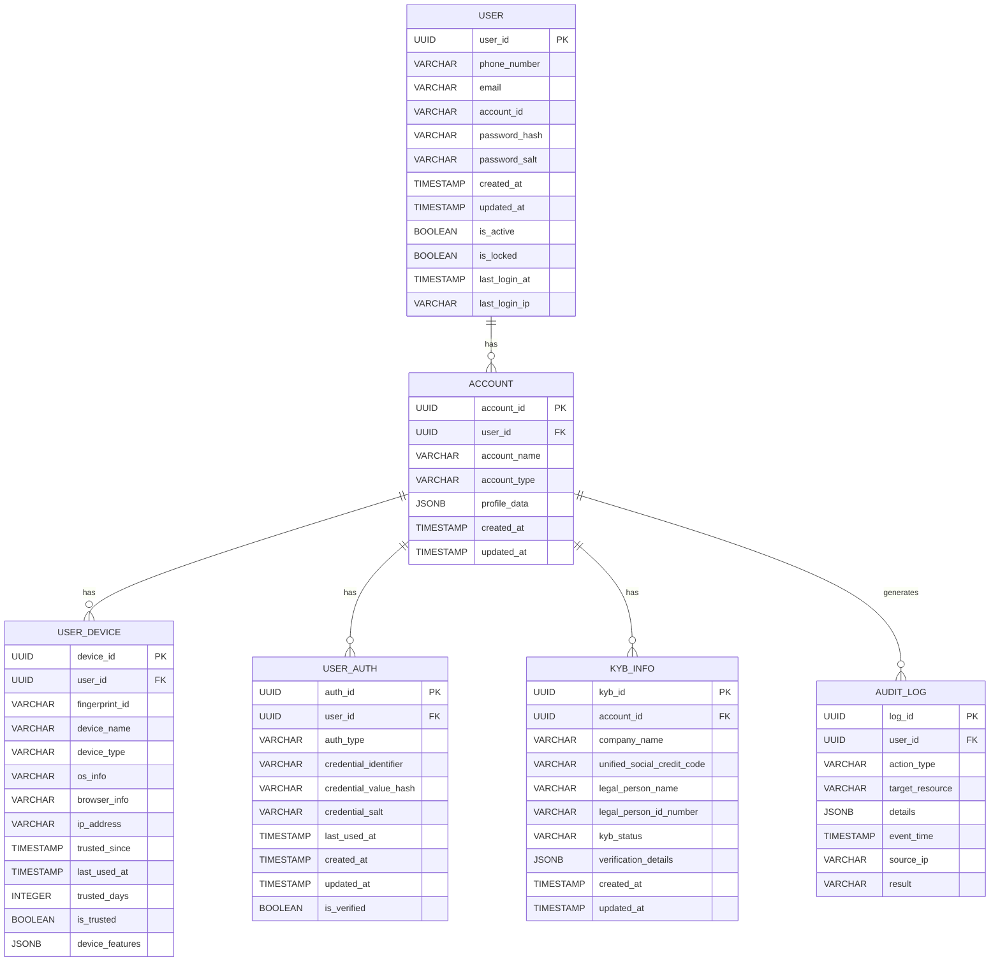
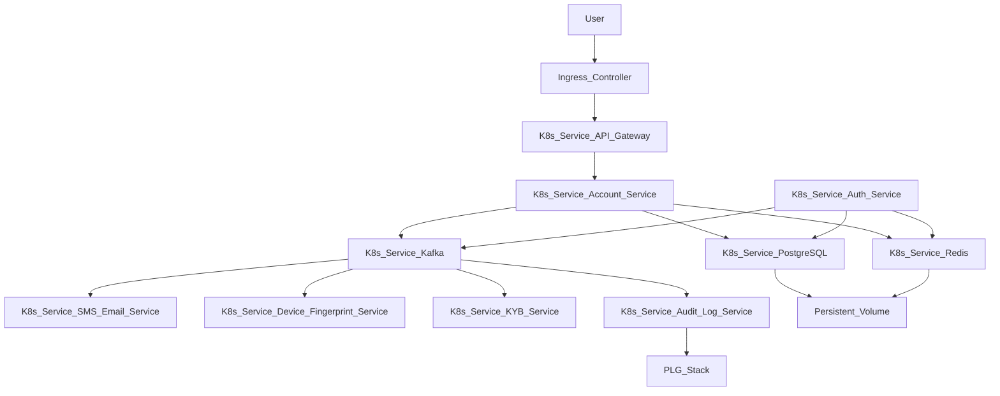

# **账户管理微服务 (Account Center) 技术实现方案 V1.0.0**

**版本：** V1.0.0 (初版)  
**日期：** 2026年5月8日  
**作者：** Manus AI  
**基于文档：** 《账户管理微服务(AccountCenter)产品需求说明书V1.1.0》

## **1. 概述**

本技术实现方案旨在为Neuro系列产品的账户管理微服务（Account Center）提供详细的技术指导。该微服务核心目标是提供符合等保三级标准、高用户体验的账户中台系统，并完善用户生命周期管理流程。本方案将涵盖系统架构、数据库设计、核心接口定义、安全合规实现以及关键业务流程的技术细节，以指导开发团队高效、高质量地完成系统建设。

## **2. 架构设计**

### **2.1 总体架构**

账户管理微服务将采用典型的微服务架构模式，独立部署，并通过API网关对外提供服务。内部组件之间通过异步消息队列（如Kafka）进行解耦，确保高可用性和可伸缩性。核心组件包括：

*   **API Gateway**：统一入口，负责请求路由、认证鉴权（初步）、限流、熔断等。
*   **Account Service**：核心业务逻辑服务，处理用户注册、登录、账户信息管理等。
*   **Auth Service**：独立认证服务，负责Token管理、会话管理、多因子认证等。
*   **SMS/Email Service**：短信和邮件发送服务，集成多云供应商，实现高可用和熔断。
*   **Device Fingerprint Service**：设备指纹识别服务，负责指纹生成、存储和风险评估。
*   **KYB Service**：企业实名认证服务，集成第三方KYB认证接口。
*   **Audit Log Service**：审计日志服务，负责日志的收集、存储和查询。
*   **Database**：PostgreSQL，存储用户账户、认证信息、设备指纹等核心数据。
*   **Cache**：Redis，用于存储验证码、会话信息、频控数据等。
*   **Message Queue**：Kafka，用于服务间异步通信、解耦和削峰。



### **2.2 技术选型**

*   **后端语言/框架**：Java/Spring Boot 或 Go/Gin (根据团队熟悉度选择，推荐Go以实现更高并发和更低资源消耗)
*   **数据库**：PostgreSQL (关系型数据库，支持事务和复杂查询)
*   **缓存**：Redis (高性能键值存储，支持多种数据结构)
*   **消息队列**：Kafka (分布式流处理平台，高吞吐、可持久化)
*   **认证鉴权**：JWT (JSON Web Token) + OAuth2 (用于第三方集成)
*   **设备指纹**：FingerprintJS (前端SDK) + 后端服务进行风险评估
*   **短信/邮件**：集成阿里云、腾讯云、天翼云等SDK
*   **KYB认证**：集成银企直连、人脸核身SDK
*   **加密算法**：国密SM4 (对称加密)、国密SM3 (哈希摘要)
*   **监控告警**：Prometheus + Grafana + Alertmanager (Promtail + Loki 用于日志)

## **3. 数据库设计**

### **3.1 核心实体关系图 (ERD)**



### **3.2 核心表结构设计**

#### **3.2.1 `users` 表**

存储用户基本信息和核心认证凭证。

| 字段名               | 数据类型      | 约束       | 描述                                     |
| :------------------- | :------------ | :--------- | :--------------------------------------- |
| `user_id`            | `UUID`        | `PK`       | 用户唯一标识符                           |
| `phone_number`       | `VARCHAR(20)` | `UNIQUE`   | 手机号码，用于登录和验证                 |
| `email`              | `VARCHAR(255)`| `UNIQUE`   | 邮箱地址，用于登录和验证                 |
| `account_id`         | `VARCHAR(50)` | `UNIQUE`   | 用户自定义账户ID，用于登录               |
| `password_hash`      | `VARCHAR(255)`| `NOT NULL` | 密码哈希值，使用 bcrypt 或 Argon2      |
| `password_salt`      | `VARCHAR(255)`| `NOT NULL` | 密码盐值                                 |
| `created_at`         | `TIMESTAMP`   | `NOT NULL` | 账户创建时间                             |
| `updated_at`         | `TIMESTAMP`   | `NOT NULL` | 账户最后更新时间                         |
| `is_active`          | `BOOLEAN`     | `NOT NULL` | 账户是否激活                             |
| `is_locked`          | `BOOLEAN`     | `NOT NULL` | 账户是否被锁定（如多次登录失败）         |
| `last_login_at`      | `TIMESTAMP`   | `NULLABLE` | 最后登录时间                             |
| `last_login_ip`      | `VARCHAR(45)` | `NULLABLE` | 最后登录IP地址                           |

#### **3.2.2 `user_devices` 表**

存储用户信任设备信息。

| 字段名               | 数据类型      | 约束       | 描述                                     |
| :------------------- | :------------ | :--------- | :--------------------------------------- |
| `device_id`          | `UUID`        | `PK`       | 设备唯一标识符                           |
| `user_id`            | `UUID`        | `FK`       | 关联用户ID                               |
| `fingerprint_id`     | `VARCHAR(255)`| `UNIQUE`   | 设备指纹ID (FingerprintJS生成)           |
| `device_name`        | `VARCHAR(255)`| `NULLABLE` | 设备名称（如“我的iPhone”）                |
| `device_type`        | `VARCHAR(50)` | `NULLABLE` | 设备类型（如“Mobile”, “Desktop”）         |
| `os_info`            | `VARCHAR(255)`| `NULLABLE` | 操作系统信息                             |
| `browser_info`       | `VARCHAR(255)`| `NULLABLE` | 浏览器信息                               |
| `ip_address`         | `VARCHAR(45)` | `NOT NULL` | 首次信任或最后使用时的IP地址             |
| `trusted_since`      | `TIMESTAMP`   | `NOT NULL` | 设备被信任的时间                         |
| `last_used_at`       | `TIMESTAMP`   | `NOT NULL` | 设备最后使用时间                         |
| `trusted_days`       | `INTEGER`     | `NOT NULL` | 免验有效期天数 N (0-60)                  |
| `is_trusted`         | `BOOLEAN`     | `NOT NULL` | 设备是否处于信任状态                     |
| `device_features`    | `JSONB`       | `NULLABLE` | 存储设备指纹采集的详细特征，用于风险评估 |

#### **3.2.3 `otp_codes` 表 (Redis 存储)**

验证码通常存储在 Redis 中，以利用其高性能和过期机制。

| Key 格式             | Value 格式    | 过期时间   | 描述                                     |
| :------------------- | :------------ | :--------- | :--------------------------------------- |
| `otp:{phone_number}` | `VARCHAR(6)`  | `300s`     | 手机短信验证码                           |
| `otp:{email}`        | `VARCHAR(6)`  | `300s`     | 邮箱 OTP 验证码                          |
| `magic_link:{token}` | `UUID`        | `300s`     | Magic Link Token 关联用户ID              |
| `rate_limit:sms:{phone_number}` | `INTEGER` | `120s`     | 短信发送频控计数                         |
| `rate_limit:sms:daily:{phone_number}` | `INTEGER` | `24h`      | 短信每日发送计数                         |

#### **3.2.4 `sessions` 表 (Redis 存储)**

用户会话信息，同样存储在 Redis 中。

| Key 格式             | Value 格式    | 过期时间   | 描述                                     |
| :------------------- | :------------ | :--------- | :--------------------------------------- |
| `session:{token}`    | `JSONB`       | `20min`    | 会话Token，包含user_id, login_time, device_id等 |
| `user_sessions:{user_id}` | `SET`     | `永不`     | 存储用户所有活跃会话Token，用于限制并发会话数和强制注销 |

#### **3.2.5 `kyb_applications` 表**

存储企业实名认证申请信息。

| 字段名                       | 数据类型      | 约束       | 描述                                     |
| :--------------------------- | :------------ | :--------- | :--------------------------------------- |
| `kyb_id`                     | `UUID`        | `PK`       | KYB申请唯一标识符                        |
| `account_id`                 | `UUID`        | `FK`       | 关联企业账户ID                           |
| `company_name`               | `VARCHAR(255)`| `NOT NULL` | 企业名称                                 |
| `unified_social_credit_code` | `VARCHAR(50)` | `UNIQUE`   | 统一社会信用代码                         |
| `legal_person_name`          | `VARCHAR(100)`| `NOT NULL` | 法人姓名                                 |
| `legal_person_id_number`     | `VARCHAR(50)` | `NOT NULL` | 法人身份证号                             |
| `verification_type`          | `VARCHAR(50)` | `NOT NULL` | 验证类型（小额打款, 人脸核身）           |
| `verification_status`        | `VARCHAR(50)` | `NOT NULL` | 验证状态（pending, verified, failed）    |
| `verification_details`       | `JSONB`       | `NULLABLE` | 验证详情（如打款金额、人脸核身结果）     |
| `created_at`                 | `TIMESTAMP`   | `NOT NULL` | 申请创建时间                             |
| `updated_at`                 | `TIMESTAMP`   | `NOT NULL` | 申请最后更新时间                         |

#### **3.2.6 `audit_logs` 表**

存储审计日志，满足等保三级合规要求。

| 字段名           | 数据类型      | 约束       | 描述                                     |
| :--------------- | :------------ | :--------- | :--------------------------------------- |
| `log_id`         | `UUID`        | `PK`       | 日志唯一标识符                           |
| `user_id`        | `UUID`        | `FK`       | 操作用户ID（若有）                       |
| `account_id`     | `UUID`        | `FK`       | 操作账户ID（若有）                       |
| `event_time`     | `TIMESTAMP`   | `NOT NULL` | 事件发生时间                             |
| `action_type`    | `VARCHAR(100)`| `NOT NULL` | 操作类型（如LOGIN, REGISTER, PASSWORD_CHANGE） |
| `target_resource`| `VARCHAR(255)`| `NULLABLE` | 操作目标资源（如用户ID, 设备ID）         |
| `source_ip`      | `VARCHAR(45)` | `NOT NULL` | 操作来源IP地址                           |
| `result`         | `VARCHAR(50)` | `NOT NULL` | 操作结果（SUCCESS, FAILURE）             |
| `details`        | `JSONB`       | `NULLABLE` | 详细信息（如失败原因、变更内容）         |
| `sm3_hash`       | `VARCHAR(64)` | `NOT NULL` | 日志内容的SM3摘要，用于完整性校验        |

## **4. 核心API接口定义**

### **4.1 用户注册 (User Registration)**

**接口：** `POST /api/v1/account/register/phone`
**描述：** 手机号注册，并设置账户ID和密码。

| 参数名         | 类型     | 必填 | 描述                                       |
| :------------- | :------- | :--- | :----------------------------------------- |
| `phone_number` | `string` | 是   | 用户手机号                                 |
| `sms_code`     | `string` | 是   | 短信验证码                                 |
| `account_id`   | `string` | 是   | 用户自定义账户ID (6-20位，字母数字下划线)  |
| `password`     | `string` | 是   | 登录密码 (符合安全策略)                    |
| `agree_terms`  | `boolean`| 是   | 是否同意用户协议和隐私政策                 |

**响应：**

```json
{
  "code": 200,
  "message": "注册成功",
  "data": {
    "user_id": "uuid-of-user",
    "access_token": "jwt-token",
    "refresh_token": "jwt-refresh-token"
  }
}
```

**接口：** `POST /api/v1/account/register/send-sms-code`
**描述：** 发送手机注册验证码。

| 参数名         | 类型     | 必填 | 描述                                       |
| :------------- | :------- | :--- | :----------------------------------------- |
| `phone_number` | `string` | 是   | 用户手机号                                 |

**响应：**

```json
{
  "code": 200,
  "message": "验证码发送成功"
}
```

### **4.2 用户登录 (User Login)**

**接口：** `POST /api/v1/account/login`
**描述：** 统一登录接口，根据凭证类型和登录方式进行认证。

| 参数名             | 类型     | 必填 | 描述                                       |
| :----------------- | :------- | :--- | :----------------------------------------- |
| `credential`       | `string` | 是   | 手机号、邮箱或账户ID                       |
| `password`         | `string` | 否   | 密码登录时必填                             |
| `sms_code`         | `string` | 否   | 短信验证码登录时必填                       |
| `email_otp`        | `string` | 否   | 邮箱OTP登录时必填                          |
| `magic_link_token` | `string` | 否   | Magic Link登录时必填                       |
| `device_fingerprint` | `string` | 是   | 前端生成的设备指纹ID                       |

**响应：**

```json
{
  "code": 200,
  "message": "登录成功",
  "data": {
    "user_id": "uuid-of-user",
    "access_token": "jwt-token",
    "refresh_token": "jwt-refresh-token",
    "is_trusted_device": true
  }
}
```

**接口：** `POST /api/v1/account/login/send-sms-code`
**描述：** 登录时发送短信验证码。

| 参数名         | 类型     | 必填 | 描述                                       |
| :------------- | :------- | :--- | :----------------------------------------- |
| `phone_number` | `string` | 是   | 用户手机号                                 |

**响应：**

```json
{
  "code": 200,
  "message": "验证码发送成功"
}
```

**接口：** `POST /api/v1/account/login/send-email-otp`
**描述：** 登录时发送邮箱OTP和Magic Link。

| 参数名         | 类型     | 必填 | 描述                                       |
| :------------- | :------- | :--- | :----------------------------------------- |
| `email`        | `string` | 是   | 用户邮箱                                   |

**响应：**

```json
{
  "code": 200,
  "message": "OTP和Magic Link已发送至邮箱"
}
```

### **4.3 修改密码 (Change Password)**

**接口：** `POST /api/v1/account/password/change`
**描述：** 修改用户密码。

| 参数名         | 类型     | 必填 | 描述                                       |
| :------------- | :------- | :--- | :----------------------------------------- |
| `current_password` | `string` | 否   | 当前密码（若通过密码验证）                 |
| `new_password` | `string` | 是   | 新密码 (符合安全策略)                      |
| `confirm_password` | `string` | 是   | 确认新密码                                 |
| `verification_code` | `string` | 否   | 短信或邮箱验证码（若通过验证码验证）       |
| `verification_type` | `string` | 是   | 验证类型（sms_code, email_otp, password）  |

**响应：**

```json
{
  "code": 200,
  "message": "密码修改成功，请重新登录"
}
```

**接口：** `POST /api/v1/account/password/send-verification-code`
**描述：** 修改密码前发送身份验证码（短信或邮箱）。

| 参数名         | 类型     | 必填 | 描述                                       |
| :------------- | :------- | :--- | :----------------------------------------- |
| `contact_type` | `string` | 是   | 联系方式类型（phone, email）               |
| `contact_value`| `string` | 是   | 联系方式值（手机号或邮箱）                 |

**响应：**

```json
{
  "code": 200,
  "message": "验证码发送成功"
}
```

### **4.4 注销账户 (Account Deletion)**

**接口：** `POST /api/v1/account/delete`
**描述：** 注销用户账户。

| 参数名              | 类型     | 必填 | 描述                                       |
| :------------------ | :------- | :--- | :----------------------------------------- |
| `verification_code` | `string` | 是   | 短信或邮箱验证码                           |
| `agree_consequences`| `boolean`| 是   | 是否同意注销后果                           |

**响应：**

```json
{
  "code": 200,
  "message": "账户已进入注销流程，将在[X]天后永久删除"
}
```

**接口：** `POST /api/v1/account/delete/send-verification-code`
**描述：** 注销账户前发送身份验证码（短信或邮箱）。

| 参数名         | 类型     | 必填 | 描述                                       |
| :------------- | :------- | :--- | :----------------------------------------- |
| `contact_type` | `string` | 是   | 联系方式类型（phone, email）               |
| `contact_value`| `string` | 是   | 联系方式值（手机号或邮箱）                 |

**响应：**

```json
{
  "code": 200,
  "message": "验证码发送成功"
}
```

## **5. 安全合规实现**

### **5.1 身份鉴别与会话管理**

*   **密码存储**：用户密码将采用 **Argon2** 或 **bcrypt** 算法进行加盐哈希存储，确保密码不可逆。禁止明文存储密码。
*   **多因子认证 (MFA)**：对于管理后台登录和B端资金操作，强制启用MFA。MFA将支持TOTP（基于时间的一次性密码）和短信/邮箱OTP。
*   **会话管理**：采用 **JWT (JSON Web Token)** 进行会话管理。Access Token 短生命周期（例如15分钟），Refresh Token 长生命周期（例如7天）。Refresh Token 需存储在安全的HTTP-only Cookie中或加密存储在数据库中，并支持吊销。
*   **并发会话限制**：通过Redis记录用户活跃会话，限制单个用户最大并发会话数。当达到上限时，新的登录请求将强制踢出最早的会话或拒绝登录。
*   **静默注销**：会话静默20分钟后，系统将自动注销会话，要求用户重新登录。

### **5.2 数据加密存储 (国密化)**

*   **敏感数据加密**：所有敏感数据（如实名数据、银行账号、薪资数据）在写入数据库前，必须使用**国密 SM4 对称加密算法**进行加密。密钥管理将采用硬件安全模块 (HSM) 或密钥管理服务 (KMS) 进行保护。
*   **数据完整性**：数据库中存储的关键鉴别信息和审计日志，将使用**国密 SM3 摘要算法**计算哈希值并一同存储，用于后续的数据完整性校验，防止数据被篡改。
*   **传输加密**：所有客户端与服务端的通信，以及微服务内部通信，必须强制使用 **TLS 1.2+** 协议进行加密传输。

### **5.3 审计治理**

*   **日志记录**：所有关键操作（如登录、注册、密码修改、账户注销、KYB认证、敏感数据访问等）都必须生成详细的审计日志。日志内容包括：操作主体（用户ID/账户ID）、操作时间、操作类型、操作结果（成功/失败）、来源IP地址、操作目标资源以及详细的变更内容或失败原因。
*   **日志存储**：审计日志将通过 Promtail 收集并存储在 Loki 中，与业务数据库分离，确保日志的独立性和安全性。
*   **日志留存**：审计日志的留存时间必须**不少于 180 天**，并具备可查询和可导出能力。
*   **日志完整性**：每条审计日志在存储时，都将计算其内容的SM3摘要，并与日志一同存储，以防止日志被篡改。

### **5.4 风险感知与熔断**

*   **设备指纹风险评估**：Device Fingerprint Service 将持续分析设备指纹数据。若检测到指纹与历史记录严重不符（例如关键硬件特征变化超过阈值），将触发风险告警，并强制用户进行强身份核验。
*   **地理位置异常检测**：通过IP地址库实时监测用户登录地理位置。若检测到异常地理位置变动（如短时间内跨地域登录），将强制用户进行强身份核验。
*   **短信/邮件服务熔断**：如PRD所述，当主通道错误率超过阈值时，自动切换至备用通道，并向运维人员告警。
*   **异常行为检测**：系统将集成异常行为检测模块，例如短时间内多次登录失败、频繁尝试修改密码等，一旦检测到异常，将触发账户锁定、临时冻结或强制MFA等措施。

## **6. 关键业务流程技术细节**

### **6.1 用户注册流程**

1.  **前端**：用户输入手机号，调用 `POST /api/v1/account/register/send-sms-code` 获取短信验证码。
2.  **Account Service**：
    *   接收手机号，进行格式校验和唯一性检查（是否已注册）。
    *   调用 SMS/Email Service 发送短信验证码，并将验证码存储到 Redis (Key: `otp:{phone_number}`, TTL: 5分钟)。
    *   记录短信发送频控信息到 Redis。
3.  **前端**：用户输入手机号、短信验证码、账户ID、密码，并勾选同意协议，调用 `POST /api/v1/account/register/phone`。
4.  **Account Service**：
    *   校验短信验证码是否正确且未过期。
    *   校验账户ID格式和唯一性。
    *   校验密码复杂度。
    *   使用 Argon2/bcrypt 对密码进行加盐哈希。
    *   在 `users` 表中创建新用户记录，`is_active` 设为 true。
    *   生成 JWT Access Token 和 Refresh Token。
    *   将 Refresh Token 存储到 Redis 或数据库。
    *   通过 Message Queue 发送注册成功事件到 Audit Log Service。
    *   返回 Token 和用户ID。

### **6.2 用户登录流程**

1.  **前端**：用户在单一输入框输入凭证（手机号/邮箱/账户ID），并输入密码或选择验证码登录，同时传递设备指纹ID，调用 `POST /api/v1/account/login`。
2.  **Account Service**：
    *   根据凭证类型（手机号/邮箱/账户ID）进行识别。
    *   **若为密码登录**：从 `users` 表获取用户密码哈希和盐值，进行密码校验。若失败，记录登录失败次数，达到阈值则锁定账户。
    *   **若为短信验证码登录**：校验短信验证码是否正确且未过期。
    *   **若为邮箱OTP登录**：校验邮箱OTP是否正确且未过期。
    *   **若为Magic Link登录**：校验Magic Link Token是否有效。
    *   **设备指纹校验**：调用 Device Fingerprint Service 进行设备指纹校验。若为信任设备且在有效期内，则直接登录。若设备指纹异常或地理位置剧变，强制进行二次验证（如短信/邮箱OTP）。
    *   **生成会话**：认证成功后，生成 JWT Access Token 和 Refresh Token。将 Refresh Token 存储到 Redis 或数据库，并记录会话信息到 Redis (Key: `session:{token}`, `user_sessions:{user_id}`)。
    *   更新 `users` 表中的 `last_login_at` 和 `last_login_ip`。
    *   通过 Message Queue 发送登录成功事件到 Audit Log Service。
    *   返回 Token 和用户ID。

### **6.3 修改密码流程**

1.  **前端**：用户登录后进入“安全设置”，点击修改密码，调用 `POST /api/v1/account/password/send-verification-code` 获取身份验证码。
2.  **Account Service**：
    *   根据用户选择的联系方式（手机/邮箱），调用 SMS/Email Service 发送验证码。
    *   将验证码存储到 Redis (Key: `otp:{user_id}:{contact_type}`, TTL: 5分钟)。
3.  **前端**：用户输入新密码、确认新密码和收到的验证码，调用 `POST /api/v1/account/password/change`。
4.  **Account Service**：
    *   校验验证码是否正确且未过期。
    *   校验新密码和确认密码是否一致，并符合安全策略。
    *   使用 Argon2/bcrypt 对新密码进行加盐哈希。
    *   更新 `users` 表中的 `password_hash` 和 `password_salt`。
    *   **强制所有旧会话失效**：通过 Redis 的 `user_sessions:{user_id}` 集合，删除所有旧的会话Token，强制用户重新登录。
    *   通过 Message Queue 发送密码修改事件到 Audit Log Service。
    *   返回成功信息。

### **6.4 注销账户流程**

1.  **前端**：用户登录后进入“安全设置”，点击注销账户，阅读须知并勾选同意，调用 `POST /api/v1/account/delete/send-verification-code` 获取身份验证码。
2.  **Account Service**：
    *   根据用户选择的联系方式（手机/邮箱），调用 SMS/Email Service 发送验证码。
    *   将验证码存储到 Redis (Key: `otp:{user_id}:{contact_type}`, TTL: 5分钟)。
3.  **前端**：用户输入验证码，再次确认注销，调用 `POST /api/v1/account/delete`。
4.  **Account Service**：
    *   校验验证码是否正确且未过期。
    *   校验用户是否同意注销后果。
    *   **账户冻结**：将 `users` 表中用户的 `is_active` 状态设置为 `false`，并记录冻结开始时间，设置一个冻结期（例如7-30天）。在此期间，用户可以恢复账户。
    *   **强制所有会话失效**：删除用户所有活跃会话Token。
    *   通过 Message Queue 发送账户注销申请事件到 Audit Log Service。
    *   **定时任务**：设置一个定时任务，在冻结期结束后，执行账户的永久删除操作（逻辑删除或物理删除）。
        *   **永久删除操作**：删除 `users` 表中用户记录，解除手机号、邮箱、账户ID的唯一性约束，删除 `user_devices`、`user_auth`、`kyb_applications` 等关联数据。敏感数据进行物理擦除或加密销毁。
        *   通过 Message Queue 发送账户永久删除事件到 Audit Log Service。
    *   返回成功信息。

## **7. 部署与运维**

### **7.1 部署架构**

微服务将部署在Kubernetes集群中，利用其容器编排能力实现自动化部署、弹性伸缩和高可用。每个服务将独立打包为Docker镜像。



### **7.2 运维监控**

*   **日志**：统一日志收集（Promtail + Loki），并通过 Grafana 进行查询、分析和故障排查。
*   **监控**：Prometheus + Grafana 监控系统各项指标（CPU、内存、网络、QPS、延迟、错误率等）。
*   **告警**：Alertmanager 配置告警规则，通过短信、邮件、钉钉等方式通知运维人员。
*   **链路追踪**：集成 Jaeger 或 Zipkin 进行分布式链路追踪，方便排查跨服务调用问题。
*   **健康检查**：每个微服务提供 `/health` 或 `/actuator/health` 接口，供Kubernetes进行健康检查和Liveness/Readiness探测。

## **8. 风险与挑战**

*   **等保三级合规**：国密算法的正确实现和密钥管理是关键，需要专业的安全团队支持。
*   **高并发处理**：登录、注册等核心接口可能面临高并发，需要进行充分的性能测试和优化。
*   **多云短信/邮件稳定性**：多供应商切换逻辑的健壮性，以及第三方服务SLA的保障。
*   **设备指纹的准确性与稳定性**：FingerprintJS的指纹识别准确率受浏览器、设备、用户行为等多种因素影响，需要持续优化和调整风险评估策略。
*   **数据迁移与兼容**：若存在老系统，数据迁移和新旧系统兼容性是重要挑战。

## **9. 总结**

本技术实现方案为账户管理微服务提供了全面的技术蓝图。通过采用微服务架构、严格的安全合规措施、高可用设计以及详细的业务流程实现，旨在构建一个稳定、安全、高性能的账户中台系统。开发团队应严格遵循本方案，并在开发过程中持续进行技术评审和测试，确保最终产品质量。
